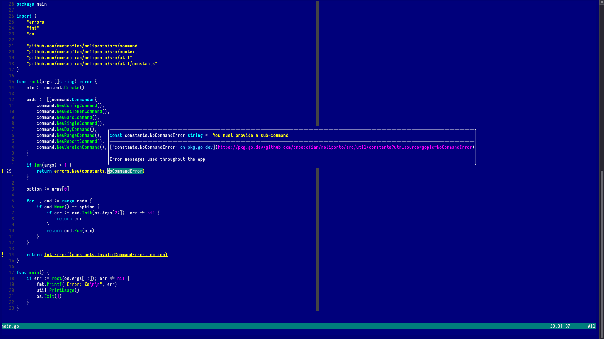
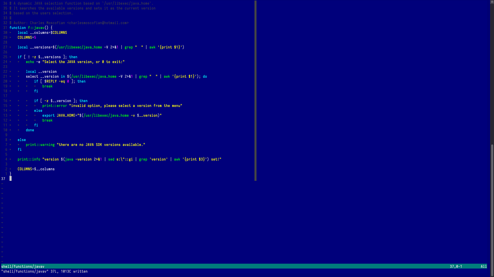
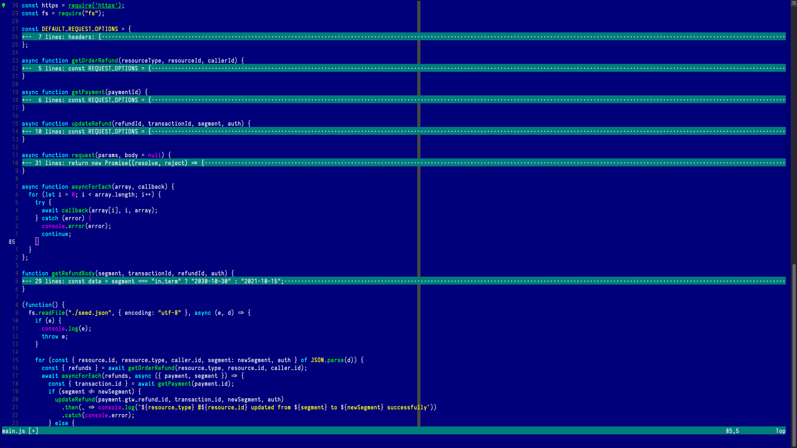

```
#    # # #####  #####  #      ######       #    # # #    # 
##   # # #    # #    # #      #            #    # # ##  ## 
# #  # # #####  #####  #      #####  ##### #    # # # ## # 
#  # # # #    # #    # #      #            #    # # #    # 
#   ## # #    # #    # #      #             #  #  # #    # 
#    # # #####  #####  ###### ######         ##   # #    # 
```

# nibble-vim

A 4-bit colorscheme for vim/ neovim strongly inspired by the good old MS-DOS.

Join me on remembering what was like pushing that i386 button and waiting a good
solid 5 minutes before we could play doom...

Here you have few examples of behaviour based on different languages, it has
support for tree-sitter (nvim).


<details>
<summary>GO</summary>


</details>

<details><summary>Bash</summary>



</details>
<details><summary>Javascript</summary>



</details>


## Instalation
---
You can use your favorite [**plugin manager**](#plugin-managers)
to install this theme and from there it is as simple as adding this to
your vimrc/init.vim:

```vim
colorscheme nibble
```

### Plugin managers
- [vim-plug](https://github.com/junegunn/vim-plug#usage):
```vim
call plug#begin()
  Plug 'cmoscofian/nibble-vim'
call plug#end()
```

- [vundle](https://github.com/junegunn/vim-plug#usage):
```vim
call vundle#begin()
  Plug 'cmoscofian/nibble-vim'
call vundle#end()
```

- [packer](https://github.com/wbthomason/packer.nvim#quickstart):


```lua
return require('packer').startup(function()
  use 'cmoscofian/nibble-vim'
end)
```

- [vim-8]:
```sh
git clone https://github.com/cmoscofian/nibble-vim.git ~/.vim/pack/theme/start/nibble-vim
```

or

```sh
git submodule add https://github.com/cmoscofian/nibble-vim.git ~/.vim/pack/theme/start/nibble-vim
```
